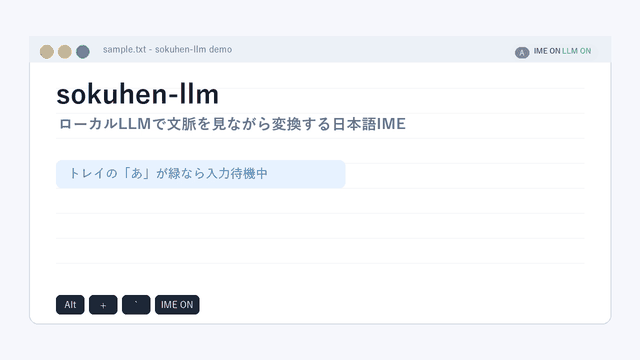

# sokuhen-llm

Windows 向け、**ローカル超軽量日本語 LLM** で文脈を見ながら変換する macOS ライクなライブ変換 IME。

`sokuhen` (即変) のエンジンに、入力中の LLM 再ランク層 (rescoring) を追加したバージョンです。同音異義語の選択を「辞書コスト + バイグラム」だけではなく、**文全体の自然さ**から判断するようになります。

- 「会議で**事故**が発生した」 vs 「会議で**自己**が発生した」
- 「書類を**しよう**する」 vs 「書類を**使用**する」
- 「**以降**も変わらず」 vs 「**行こう**も変わらず」

## 使用デモ動画



IME の ON/OFF、ライブ変換、候補一覧、数字キーでの直接選択、`Ctrl+Backspace` での直前チャンク削除、`Shift+英字` の直接入力、`Enter` 確定までを一通り確認できます。

## 完全ローカル

- モデル推論は全てローカル (`transformers` + `torch`)
- **外部 API 呼び出しは一切なし**
- 一度 `download_model` したら、以降はオフラインで動作 (`local_files_only=True`)
- 学習データ・ログはユーザーディレクトリ内にのみ保存

デフォルトモデル: **`rinna/japanese-gpt2-small`** (110M params, MIT licence, ~440 MB on disk)

代替モデル (環境変数 `SOKUHEN_LLM_MODEL` で指定可):
- `cyberagent/open-calm-small` (160M, OpenCalm, ~640 MB)
- `llm-jp/llm-jp-3-150m` (150M, Apache 2.0)
- `rinna/japanese-gpt-neox-small` (160M, MIT)

## アーキテクチャ

```
[キーストローク]
      ↓
[ローマ字→ひらがな]
      ↓
[Viterbi 変換] ← SKK-JISYO.L / edict2 / バイグラム LM / ユーザー学習
      ↓ top-N candidates per segment
┌─────────────────────────────────────────────────────┐
│ [LLM Rescoring]                                      │
│   debounce after typing; latest state only           │
│   for each segment:                                  │
│     for each top-K candidate:                        │
│       score = LLM.logprob(frozen + surface sequence) │
│     pick max                                         │
│   runs on a background worker                        │
└─────────────────────────────────────────────────────┘
      ↓ LLM-preferred surface
[ライブ表示]
      ↓ Enter (commit)
[SendInput / PostMessageW]
```

**ポイント**: LLM は**生成ではなくスコアリング**に使う。Viterbi が各 segment で候補を返すので、LLM は各候補を試して文全体の対数尤度を比較するだけ。このため 100-200M パラメータの小型モデルでも十分精度が出る。

## LLM が発動するタイミング

| タイミング | LLM 呼び出し | レスポンス |
|---|---|---|
| キー入力中 | あり (debounce + 最新状態のみ) | キーフックは即時応答、再スコアは背景スレッド |
| Space (候補選択) | なし | 瞬時 |
| **Enter (確定)** | なし (表示中の候補を確定) | 瞬時 |

LLM は入力のたびに直接ブロックせず、短い debounce 後に背景スレッドで最新の変換状態だけを再評価します。ユーザーが Space や矢印キーで候補を手動選択した後は、その選択を尊重して LLM の上書きを止めます。

## 動作要件

- Windows 10/11 (x64 / ARM64)
- Python 3.11 以降
- 空き RAM 2 GB 以上 (モデル読み込み用)
- ディスク: 基本セットで ~5 MB、LLM モデル込みで ~500 MB、PyTorch 込みで ~2 GB

## セットアップ

**カンタン**:

1. `sokuhen-llm.bat` をダブルクリック
2. 初回は自動で
   - IME 依存 (PyQt6 等) インストール
   - SKK-JISYO.L ダウンロード
   - transformers + PyTorch インストール (~1.5 GB)
   - LLM モデルダウンロード (~440 MB)
3. トレイアイコン出現 → `Alt + `\` で ON/OFF

**手動**:

```bash
# 基本セット
python -m pip install -e .

# + LLM レイヤー (任意)
python -m pip install -e ".[llm]"

# 辞書 + モデルをダウンロード
python -m sokuhen_llm.scripts.download_dict
python -m sokuhen_llm.scripts.download_model

# 起動
python -m sokuhen_llm
```

**動作確認**:

```bash
python -m sokuhen_llm --selftest               # 辞書ロード + UI生成のみ
SOKUHEN_LLM_DISABLE=1 python -m sokuhen_llm    # LLM 無しで起動
```

## 環境変数

| 変数 | 効果 |
|---|---|
| `SOKUHEN_LLM_DISABLE=1` | LLM レイヤーを完全に無効化 (素の sokuhen と同じ挙動) |
| `SOKUHEN_LLM_MODEL=<id>` | 使用モデルを切替 (例: `cyberagent/open-calm-small`) |

## Rescoring の仕組み

`src/sokuhen_llm/llm/rescorer.py`:

```python
class Rescorer:
    def rescore(frozen_prefix, viterbi_result, initial_overrides):
        choices = [0] * n_segments  # start from Viterbi winner (idx 0)

        for i, seg in enumerate(result.segments):
            best_score = LLM.score(frozen + current_surface)
            for k in range(min(len(seg.candidates), max_k=4)):
                if k == choices[i]: continue
                s = LLM.score(frozen + surface_with_choice(i, k))
                if s - best_score >= threshold:  # 0.5 nats by default
                    best_score = s
                    choices[i] = k

        return RescoreResult(overrides=choices, surface=final, llm_hits=...)
```

- **Threshold** (`score_threshold=0.5`): LLM の好む候補がこれより僅差で勝てない場合は Viterbi の選択を尊重。→ 辞書が自信あるケースで LLM が暴走しない
- **max_candidates_per_segment** (4): 各 segment で LLM に評価させる候補の上限。多すぎると遅くなる
- **Greedy (左→右)**: segment を左から右に順に最適化。最初の segment の決定は次の segment のスコアリング時に context に含まれるので、結果は beam search に近い精度で O(N*K) で済む

## キー割り当て

sokuhen と同じ。

| キー | 動作 |
| --- | --- |
| `Alt + ~` | ON/OFF トグル |
| 半角/全角、英数、無変換等 | OS IME 状態に自動追従 |
| 英字キー | ローマ字→かな合成 |
| `Space` | 候補選択 |
| `1-9` / テンキー `1-9` | 候補一覧表示中の直接選択 |
| `↑` / `↓` | 候補移動 |
| `PgUp` / `PgDn` | 候補を9件単位で移動 |
| `Home` / `End` | 候補または文節の先頭/末尾へ移動 |
| `Ctrl + Backspace` | 変換中の直前チャンク削除 |
| `Shift + 英字` | 日本語入力中でも英字を直接入力 |
| `Enter` | 確定 |
| `Esc` | 取消 |
| `F7-F10` | カナ/半角カナ/全角英数/半角英数 |

## ライセンス

- 本体コード: **MIT**
- SKK-JISYO.L: **GPL v2+**
- edict2: **CC-BY-SA 3.0**
- `rinna/japanese-gpt2-small`: **MIT**
- その他モデルは各自のライセンスに従う

## 関連プロジェクト

- [sokuhen](https://github.com/k773954/sokuhen) — LLM なしの軽量版。同じ辞書エンジンを使うがファイルサイズ・メモリ共に桁違いに軽い。LLM 依存を入れたくない場合はこちら。
